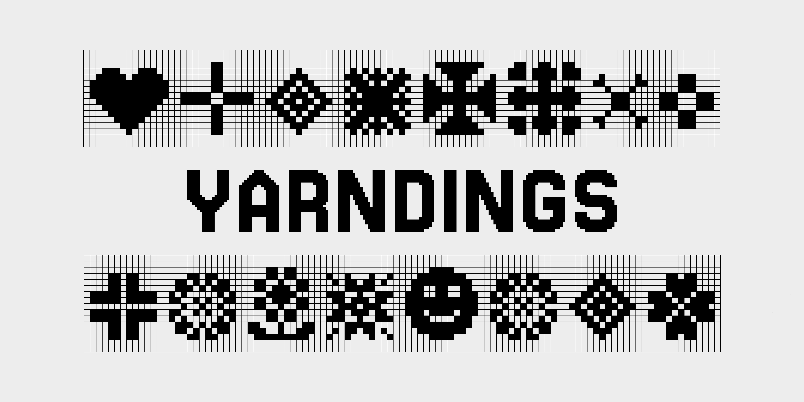

<h1>The Soft Type Collection, Yarndings</h1>

<h5>The Typeface</h5>

Yarndings is an ornamental typeface inspired by a mix of typographic ornamentation, traditional Fair Isle & Nordic knitting patterns, and dingbat fonts from the 1990’s.

<h5>The Collection</h5>

Soft Type is a collection of typefaces designed for knitting color-work. Each typeface has a “Regular” and “Charted” version and some include multiple scales so you can fit type on your knits, no matter the project's size. 

Designing typefaces for knitting is essentially the same as designing pixel type. However, in practice, the pixel size is determined by the properties of the yarn in use. Scale is determined by the weight of the yarn as well as the number of pixels that make up the height of each letter. In this collection, the number following the name of the typeface indicates the height of the capital letters for that typeface. 

These typefaces were designed with machine knitting in mind, but could be used for hand knitting, needlework, bedazzling, or many other textile crafts. 

Note: for Fair Isle knitting you do need to beware of floats and plan accordingly as always.

<h5>Designers Involved</h5>
Designer: Sarah Cadigan-Fried  
Copyright 2023 Sarah Cadigan-Fried (sarahcadiganfried@gmail.com)

<h5>License</h5>
This Font Software is licensed under the SIL Open Font License, Version 1.1. This license is copied below, and is also available with a FAQ at: https://scripts.sil.org/OFL
